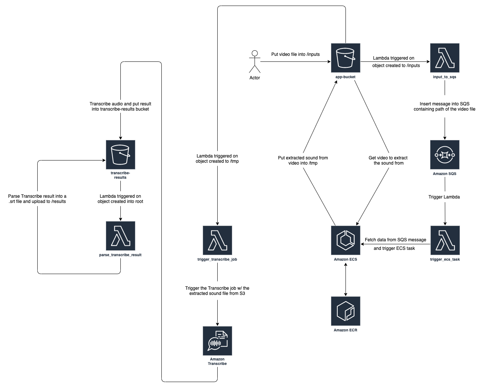

## Automatic Subtitles Generation and Synchronization with AWS Transcribe

### Intro
[AWS Transcribe](https://aws.amazon.com/transcribe/) allows to automaticaly convert speech to text using their own Machine Learning trained model. <br/>
Using it, I created a project to generate and synchronize subtitles from a given video as an input file. <br />
This repo contains the Terraform templates in order to deploy the solution in AWS, as well as the code used for the Lambdas and the code used by the ECS from ECR.

### Basic idea
1. Put a video file as input in a S3 folder.
2. Get the result as a .srt file

### Repository explanations
* [./code](./code)
The code directory is composed if 3 sub-directories: docker, lambdas and local.

  * [./code/docker](./code/docker)
This part contains the Python code which is used by the ECS task to extract the sound from the video. The Dockerfile is used to built the Docker container which needs to be pused to the ECR repo. <br/>
With [fish](https://fishshell.com/) shell:
```
eval (aws ecr get-login --no-include-email --region <region>)
docker build -t ecr_media_processing .
docker tag ecr_media_processing:latest <account_id>.dkr.ecr.<region>.amazonaws.com/ecr_media_processing:latest
docker push <account_id>.dkr.ecr.<region>.amazonaws.com/ecr_media_processing:latest
```

   * [./code/lambdas](./code/lambdas)
This directory contains the Python code used by the AWS Lambdas.

   * [./code/local](./code/local)
The local folder was my starting point, and was used to validate my initial idea. <br/>
It contains the Python code to locally test the Transcribe job. It takes a video path as an input and make the AWS API calls in order to receive the .srt final result. <br />
To use it:
1. Export your AWS profile into the shell.
2. Create a S3 Bucket.
3. Fill up [config.json](./code/local/config.json).
4. Execute the Transcribe job: `python3 transcribe.py`

* [Infrastructure](./infrastructure) <br/>
This directory contains all the necessary templates and resources to deploy the infrastructure on AWS.
##### [compostions](./infrastructure/compositions)
##### [ecs_definition](./infrastructure/ecs_defintion)
##### [policies](./infrastructure/policies)
##### [resources](./infrastructure/resources)


### How to deploy

### Architecture
#### Schema
Below is the architecture deployed by the Terraform template.


#### Workflow

### Machine Learning Model model accuracy
Way went -> We went

### Problem encoutered and solution found

### Notes and future improvements
Reference the `notes.md` file. Sharding (not sure if I should mention). Frontend.